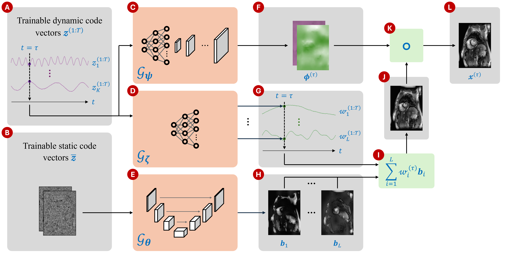

# Motion-Guided Deep Image Prior (M-DIP)

Contact: marc.vornehm@fau.de, rizwan.ahmad@osumc.edu

## Publication
This work has been submitted for publication in Magnetic Resonance in Medicine.
A preprint is available on [arXiv](https://arxiv.org/abs/2412.04639).

## Overview
Motion-Guided Deep Image Prior is a novel unsupervised reconstruction framework for accelerated realtime cardiac MRI.
M-DIP employs a spatial dictionary to synthesize a time-dependent template image, which is further refined using time-dependent deformation fields that model cardiac and respiratory motion.

## Setup
M-DIP is tested using Python 3.12 on Linux. Install the required packages using
> `pip install -r requirements.txt`

To run LR-DIP for comparison, create a separate environment based on Python 3.12 and install the respective packages using
> `pip install -r requirements_lrdip.txt`

## Data
Raw data should be placed in a subdirectory `data/`.
The in-vivo data used in our [publication](#publication) cannot be published.
Instead, we recommend using real-time cine data from the [OCMR dataset](https://ocmr.info), ideally with at least 100 frames.

## Implemented methods
- M-DIP: in `M-DIP.ipynb`
- Low rank plus sparse (Otazo et al., https://doi.org/10.1002/mrm.25240): in `M-DIP.ipynb`, section `L+S reconstruction`.
- LR-DIP (Hamilton et al., https://doi.org/10.1007/s10334-023-01088-w): in `LR-DIP.ipynb`, see more details below.

## M-DIP
### Running in Jupyter Notebook
All parameters and paths can be changed via the variables defined in the second cell. Specify the folder containing raw data in MRD format in `raw_folder`, the desired output folder in `out_folder`, and the name of the raw data file in `filename`.

### Running from command line
The Jupyter Notebook can be executed from the command line using the papermill package (included in `requirements.txt`).

You can furthermore overwrite any of the parameters defined in the second cell using the `-p` switch, where each parameter has to be preceeded by the switch:
> `papermill M-DIP.ipynb temp.ipynb [-p <parameter> <value> ...]`

Example:
> `papermill M-DIP.ipynb temp.ipynb -p n_bases 15 -p filename <filename>`

Note that `temp.ipynb` can be any arbitrary Jupyter Notebook filename.

## LR-DIP
Code for the LR-DIP reconstruction was kindly provided by Jesse Hamilton (University of Michigan) and was adjusted for Cartesian data and for parameterization using papermill.
Note that the code does not follow the descriptions from the paper in every aspect. However, the provided code gave the best results.

Similar to the procedure described for M-DIP above, the notebook can be executed via the command line using
> `papermill LR-DIP.ipynb temp.ipynb [-p <parameter> <value> ...]`
